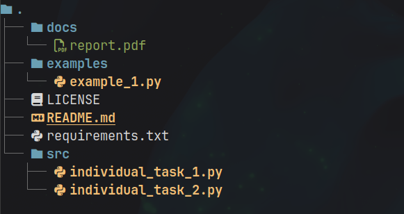

# Лабораторная работа №1 (4.1)
**Предмет** Объектно-ориентированное программирование  
**Тема:** Элементы объектно-ориентированного программирования в языке Python  
**Вариант:** 8  

## Содержание

1. [Описание работы](#описание-работы)  
2. [Ссылка на отчет](#ссылка-на-отчет)  
3. [Структура репозитория](#структура-репозитория)  
4. [Задания](#задания)  

---

## Описание работы

Приобретение навыков по работе с классами и объектами при написании программ с помощью языка программирования Python версии 3.x.

---

## Ссылка на отчет

[Отчет о выполнении лабораторной работы](docs/report.pdf)

---

## Структура репозитория

- `docs/` — отчет по лабораторной работе
- `examples/` — примеры из лабораторной работы  
- `src/` — исходный код программы  
- `requirements.txt` — список зависимостей

---

## Задания

### Задание 1
[Исходный код задания](src/individual_task_1.py)

Парой называется класс с двумя полями, которые обычно имеют имена first и second. Требуется реализовать тип данных с помощью такого класса. Во всех заданиях обязательно должны присутствовать:
* метод инициализации __init__ ;метод должен контролировать значения аргументов на корректность;
* ввод с клавиатуры read ;
* вывод на экран display .

Реализовать внешнюю функцию с именем make_тип() , где тип — тип реализуемой структуры. Функция должна получать в качестве аргументов значения для полей структуры и возвращать структуру требуемого типа. При передаче ошибочных параметров следует выводить сообщение и заканчивать работу.

В раздел программы, начинающийся после инструкции if __name__ = '__main__': добавить код, демонстрирующий возможности разработанного класса.

Поле first — целое число, левая граница диапазона, включается в диапазон; поле second — целое число, правая граница диапазона, не включается в диапазон. Пара чисел представляет полуоткрытый интервал [first, second). Реализовать метод rangecheck() — проверку заданного целого числа на принадлежность диапазону.

### Задание 2
[Исходный код задания](src/individual_task_1.py)

Составить программу с использованием классов и объектов для решения задачи. Во всех заданиях, помимо указанных в задании операций, обязательно должны быть реализованы следующие методы:
* метод инициализации __init__ ;
* ввод с клавиатуры read ;
* вывод на экран display .

В раздел программы, начинающийся после инструкции if __name__ = '__main__': добавить код, демонстрирующий возможности разработанного класса.

